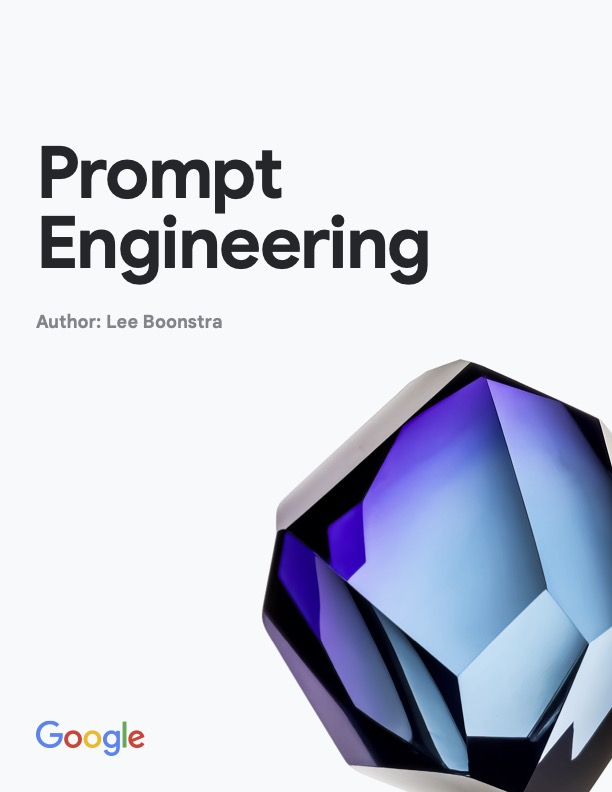

[comment]: # (This presentation was made with markdown-slides)
[comment]: # (This is a CommonMark compliant comment. It will not be included in the presentation.)
[comment]: # (Compile this presentation with the command below)
[comment]: # (mdslides presentation.md --include media)

[comment]: # (Set the theme:)
[comment]: # (THEME = blood)
[comment]: # (CODE_THEME = base16/zenburn)
[comment]: # (The list of themes is at https://revealjs.com/themes/)
[comment]: # (The list of code themes is at https://highlightjs.org/)

[comment]: # "You can also use quotes instead of parenthesis"
[comment]: # 'Single quotes work too'
[comment]: # "THEME = blood"

[comment]: # (Pass optional settings to reveal.js:)
[comment]: # (controls: true)
[comment]: # (keyboard: true)
[comment]: # (markdown: { smartypants: true })
[comment]: # (hash: false)
[comment]: # (respondToHashChanges: false)
[comment]: # (Other settings are documented at https://revealjs.com/config/)

 <!-- .element: style="align: right; height:20vh; max-width:80vw; image-rendering: crisp-edges;" -->

Ben Thomasson | Ansible | May 22, 2025

## Prompt Engineering Workshop


[comment]: # (!!! data-background-color="black")

- The basics of LLMs

[comment]: # (!!! data-auto-animate)

- The basics of LLMs
- Prompt Engineering

[comment]: # (!!! data-auto-animate)

- The basics of LLMs
- Prompt Engineering
- Towards Agents

[comment]: # (!!! data-auto-animate)

Deep Dive into LLMs

<iframe width="560" height="315" src="https://www.youtube.com/embed/7xTGNNLPyMI" frameborder="0" allow="accelerometer; autoplay; clipboard-write; encrypted-media; gyroscope; picture-in-picture" allowfullscreen></iframe>

[comment]: # (!!!)

 <!-- .element: style="height:50vh; max-width:80vw; image-rendering: crisp-edges;" -->

[Prompt Engineering](https://www.kaggle.com/whitepaper-prompt-engineering)

[comment]: # (!!!)

- [Understanding is Compression](https://arxiv.org/pdf/2407.07723)
- [Intelligence is Accurate Prediction](https://link.springer.com/article/10.1007/s13164-021-00538-5)

[comment]: # (!!!)

LLMs compress the input data set about 200 times (for llama3).

15 trillion tokens at 4 bytes each into 300GB of model weights.

[comment]: # (!!!)

LLMs predict the next token by calculating the probability of every token in its vocabulary.

[comment]: # (|||)

Then LLMs sample from the distribution to find the next token.

[comment]: # (|||)

 <!-- .element: style="align: right; height:50vh; max-width:80vw; image-rendering: crisp-edges;" -->

[Ref: A Gentle Introduction to LLM APIs](https://wandb.ai/darek/llmapps/reports/A-Gentle-Introduction-to-LLM-APIs--Vmlldzo0NjM0MTMz)


[comment]: # (|||)

This is similar to a graphics pipeline calculating RGB for every pixel on the screen each frame.

[comment]: # (|||)

Each token requires another trip through the model which can provide a small amount of thinking.

[comment]: # (|||)

More tokens = more thinking.

[comment]: # (!!!)

Let's see how LLMs see text as tokens using [Tiktokenizer](https://tiktokenizer.vercel.app/?model=deepseek-ai%2FDeepSeek-R1).

[comment]: # (!!!)

## Workshop Requirements

- Python3
- Ollama
- An LLM
- [Prompt Engineering Workshop Code](https://github.com/benthomasson/prompt-engineering-workshop)

[comment]: # (!!!)

Let's dive into the code and see how we can use LLMs to generate text, solve problems, and perform actions.

[comment]: # (|||)

System:
```
You are a helpful code assistant who is an expert
in writing Python programs.
```

User:
```
Write a hello world program in python
```

[comment]: # (|||)

Context:
```
You are a helpful code assistant who is an expert
in writing Python programs.

Write a hello world program in python
```

[comment]: # (|||)

Response:

```
'''python
# This is a simple "Hello, World!" program in Python

def main():
    print("Hello, World!")

if __name__ == "__main__":
    main()
'''

This script defines a function `main()`, which prints
the string "Hello, World!". The `if __name__ == "__main__":`
part ensures that this block of code runs only if the script
is executed directly (not imported as a module),
calling the `main()` function.
```

[comment]: # (|||)

### Prompt Structure

1. Role
1. General Purpose
1. Context Information
1. Rules and Constraints
1. Specific Task

[comment]: # (!!! data-auto-animate)

### Prompting Techniques

- Zero Shot

[comment]: # (!!! data-auto-animate)

### Prompting Techniques

- Zero Shot
- One Shot

[comment]: # (!!! data-auto-animate)

### Prompting Techniques

- Zero Shot
- One Shot
- Few Shot

[comment]: # (!!! data-auto-animate)

### Prompting Techniques

- Zero Shot
- One Shot
- Few Shot
- System Prompting

[comment]: # (!!! data-auto-animate)

### Prompting Techniques

- Zero Shot
- One Shot
- Few Shot
- System Prompting
- Role Prompting

[comment]: # (!!! data-auto-animate)

### Prompting Techniques

- Zero Shot
- One Shot
- Few Shot
- System Prompting
- Role Prompting
- Contextual Prompting

[comment]: # (!!! data-auto-animate)

### Advanced Techniques

- Step-back Prompting

[comment]: # (!!! data-auto-animate)

### Advanced Techniques

- Step-back Prompting
- Chain-of-Thought Prompting

[comment]: # (!!! data-auto-animate)

### Advanced Techniques

- Step-back Prompting
- Chain-of-Thought Prompting
- Self-Consistency Prompting

[comment]: # (!!! data-auto-animate)

### Advanced Techniques

- Step-back Prompting
- Chain-of-Thought Prompting
- Self-Consistency Prompting
- Reason and React (ReAct)

[comment]: # (!!! data-auto-animate)

**Agents (ReAct)**

- Agents = LLM + Agent framework
- Agent frameworks provide tool calling
- LLMs choose which tools to use
- Tools send information back to the LLM

[comment]: # (!!!)
